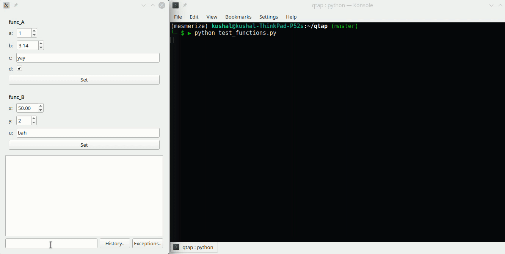

## Automatic Qt parameter entry widgets using function signatures
[](https://badge.fury.io/py/qtap) [](https://pepy.tech/project/qtap) [](https://qtap.readthedocs.io/en/latest/?badge=latest)

**Install using pip:** ``pip install qtap``

### Basic usage:



```python

from PyQt5 import QtWidgets
from qtap import Functions
from pyqtgraph.console import ConsoleWidget


def func_A(a: int = 1, b: float = 3.14, c: str = 'yay', d: bool = True):
    pass


def func_B(x: float = 50, y: int = 2.7, u: str = 'bah'):
    pass


if __name__ == '__main__':
    app = QtWidgets.QApplication([])
    
    # just pass your functions as a list, that's it!
    functions = Functions([func_A, func_B])

    console = ConsoleWidget(parent=functions, namespace={'this': functions})
    functions.main_layout.addWidget(console)

    functions.show()

    app.exec()
```
